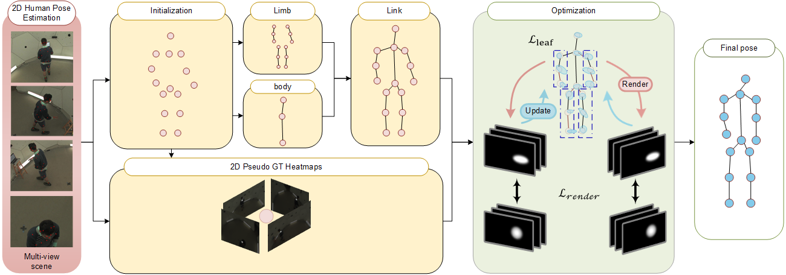

# MoSplat: Motion-Driven Skeletal Topology Discovery from Multi-View Videos via 3D Gaussian Splatting

We propose MoSplat, a novel framework for multi-view 3D human pose estimation based on differentiable Gaussian rendering.
Human pose is modeled as a set of discrete 3D Gaussian joints, which are organized into body-part groups and progressively connected through motion-driven topology inference without 3D ground-truth supervision.



## 📦 Installation
```bash
git clone https://github.com/Lavyjielun/MoSplat.git --recurse-submodules

pip install -r requirements.txt

pip install submodules/fused-ssim
pip install submodules/simple-knn

pip install submodules/diff-gaussian-rasterization-h36m
pip install submodules/diff-gaussian-rasterization-panoptic
pip install submodules/diff-gaussian-rasterization-foshan
```


## ⚙️ Data Preparation

SkelSplat has been tested on four datasets: Human3.6M, CMU Panoptic and KungFu Cap.
For data preparation refer to [Data Preprocessing](dataset_tools/README.md) and code provided in `dataset_tools/`.

## 🚀 How to run the code

Run and evaluate SkelSplat on your dataset simply using `train.py` and `eval.py`.
Configuration files for the datasets used in our paper are available in the `configs/` directory (h36m.yaml, panoptic.yaml, etc.).

```bash
python train.py --config-name <dataset>.yaml 
python eval.py --config-name <dataset>.yaml
```

The code is based on the [Skelsplat](https://github.com/laurabragagnolo/SkelSplat.git) repository (thanks to the authors for sharing their code). Please consider citing their work too.
wait